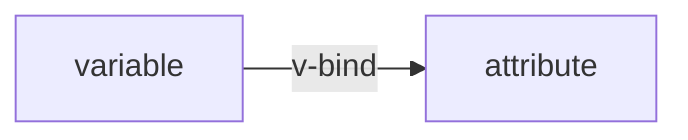
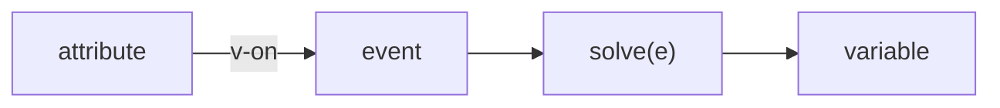
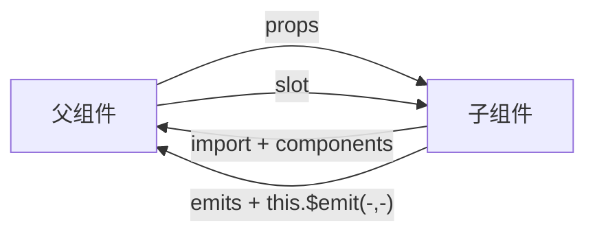

### 1.声明式渲染 ###

单文件组件(Single-File Component, SFC)

Vue 的核心功能是**声明式渲染**：通过扩展于标准 HTML 的模板语法，我们可以根据 JavaScript 的状态来描述 HTML 应该是什么样子的。当状态改变时，HTML 会自动更新（即 响应式）

```title="App.vue"
<script>
export default {
  // 组件选项
  // 此处声明一些响应式状态，比如：
	data(){
		return { msg: 'hello world!' }
	}
	
}
</script>

<template>
  // 这里可以以 {{ ... }}  的形式引用（甚至可以使用 js 函数等等），如：
	<p> {{ msg }} </p>
</template>
```

上述 `data()` 函数返回一个 map 对象

### 2.Attribute 绑定 ###

在 Vue 中，mustache 语法 (即双大括号) 只能用于 **文本插值**，为了给 attribute 绑定一个动态值，需要使用 {==`v-bind`==} 指令：

`<div {==v-bind:id="dynamicId"==}></div>`  $\iff$ `<div {==:id="dynamicId"==}></div>` 

（`v-bind` 是常用的指令，由于其常用性，所以`v-bind`可以省略；冒号`:` 后的 `id` 是该指令的参数，类似于 html 标签的属性名；等式 `=` 右边的部分对应 `data()` 函数返回的对象的 key 指定的值）

下图为 `v-bind` 实现的功能，即将 `export default` 内的某个变量 `variable` 绑定到某个标签属性 `attribute`



其中变量改变会导致属性改变，但属性改变不会导致变量改变	

### 3.事件侦听 ###

{==`v-on`==} 是用于 DOM 事件侦听的指令，可以简写为 `@`，例如：

`<button {==v-on:click="add"==}>{{ count }}</button>` $\iff$ `<button {==@click="add"==}>{{ count }}</button>`

此代码在点击(`click`) `button` 标签后，会触发该标签的 `click` 事件，然后回调指定的函数 `add()`（该函数在`<script>` 标签中 `export default` 后面的对象中 key=`methods` 对象所指定的函数集合中）

!!! question
	- `<script>` 标签中 `export default` 后面紧跟一个对象，该对象可以放 键值对，也可以放 函数？


下图为 `v-on` 实现的功能，即将 html **事件**属性 `attribute` 绑定到(或 关联到) 某个事件 `event`，该事件又会绑定到某个事件处理函数 `solve(e)` （e 是原生的 DOM 事件）；此时 `solve(e)` 可以选择性地改变 `export default` 域中的变量 `variable` （最终可以实现 `attribute` 和 `variable` 的双向关联）




### 4.表单绑定 ###

{==`v-model`==} 指令为 `input` 或 多选框、单选框、下拉框等输入标签简化了 `export default` 域中的变量 `variable` 与这些标签的 `value` 属性之间的 **双向关联** 所需要做的步骤（如：`v-bind` 指令，`v-on` 指令 以及自定义事件处理函数的组合 能实现相同功能）

示例：

`<input v-model="text">` $\iff$ `<input :value="text" @input="onInput">` + 
```
methods: {
  onInput(e) {
    this.text = e.target.value
  }
}
```

### 5.条件渲染 ###

`v-if` 指令指定标签是否渲染标签 或 元素，若该指令返回`falsy`，那么将会渲染 `v-else` 指定的标签（如果存在）

示例：

```
<h1 v-if="awesome">Vue is awesome!</h1>
<h1 v-else>Oh no 😢</h1>
```

### 6.列表渲染 ###

`v-for` 指令可以迭代 `variable`（通常是对象 或 数组），通常用于列表标签 `ol` 或 `li` 

有两个参数：迭代器 `iterater` 和 `variable`；其中迭代器可以在 vue 指令的内部使用 或 用于申明式渲染 `{{}}` 内，而且 迭代器 `iterator` 是一个局部变量

示例： 

```
<li v-for="x in arr" :key="x.id">
    {{ x.text }}
</li>
```

!!! 应用
	- 展示数组的所有元素，提交表单可以添加列表，点击某个列表还能精确删除某个列表 [参考](https://cn.vuejs.org/tutorial/#step-7)

### 7.计算属性 ###

计算属性是 `export default` 中的“对象”（类似于`data()` 和 `methods`），该对象为 {==`computed`==}；`computed` 内包含实则为函数列表，每个函数都可以返回一个对象，进而使得对象被 vue 的 `v-for` 作为逻辑上的 数组 或 对象 进行访问

`data()` 内的数据 和 `computed` 内的数据的实质区别是：前者当前保存在内存中的静态数据，而后者是逻辑上的动态数据（即 `computed` 通过当前的静态数据的组合来 构造 或 计算 动态数据）


### 8.生命周期 & 模板引用 ###

**生命周期钩子** 允许我们在组件的特定生命周期调用回调函数，如`mounted()`，`created()`，`updated()`，这些函数为 `export default` 的元素之一

在这些函数内可以通过 `this.$refs` 访问所有被 `ref` 属性指定的标签（但这些标签不仅限于在这些函数内部可以访问）

### 9.侦听器 ###

`watch` 用于侦听 `data()` 内每个变量变化，并提供该变量变化的处理函数（回调）

`watch` 是 `export default` 中的对象，其中每个元素都是以 `data()` 中某个变量作为函数名，仅有一个参数的函数，该参数是该变量变化之后的状态值（但是原来的状态值不能被调用？）

### 10.组件 ###

`components` 是 vue 用于注册子组件的关键字，同样也位于 `export default` 中

导入并注册后的组件，就能之间在 `<template>` 中调用了


!!! note "step"
	1.	导入子组件：如，`import ChildComp from './ChildComp.vue'`
	2.	注册子组件：`components:{ ChildComp }`
	3.	调用子组件：`<ChildComp />`


### 11.props ###

{==`props`==} 用于为子组件预定义某些参数，在`export default`中声明；组件调用子组件时，可以选择性地向子组件传递 参数 或 属性，已以产生父子组件的交互

!!! tip
	- 子组件本身就是用来被调用的，其功能类似于函数，因此子组件也拥有参数
	- 调用当前组件（子组件）的组件同样需要用 导入，注册 和 调用 当前组件
	- 可以实现 父组件 到 子组件 的单向数据传递


### 12.emits ###

子组件通过 {==`emits`==} 向父组件注册事件，`emits` 指定了一个字符串数组，每个字符串对应一个事件

子组件进而能使用 `this.$emit(事件名, 事件对象)` 将已经通过 `emits` 注册过的事件传递给父组件

那么父组件可以侦听该子组件(不能是其他组件，如原生html标签) 注册 并 发送 的事件 并 使用相应的事件处理函数来处理事件


!!! tip
	- 实质上是 子组件 到 父组件 的单向数据传递


### 13.slot(插槽) ###

`slot` 是一个标签，在子标签的 `template` 元素(标签)的任意位置放置 `slot` 元素，那么父组件在调用该组件时通过 `<ChildComp>{==content==}</ChildComp>` 标签中间传递内容，就会将该内容替换为子组件中


!!! note
	- 子组件中 `<slot>` 有两种使用方式：
	- `<slot />`：不提供默认值（父组件不传递内容时，会显示默认值）
	- `<slot> content </slot>`：提供默认值


!!! note "父组件 与 子组件 之间的数据传递："



### 总结 ###

- `<script>` 内的 `export default{ ... }` 用于放 `vue` 组件，以逗号间隔
- vue 的部分代码在 `<template>` 标签中
- 声明式渲染：`{{ ... }}`
- `this`：用于调用 `vue` 的变量，如：`$refs`


!!! note "常见组件"
	- `data(){ return { ... } }`：预执行的语句，返回一个 `map`
	- `methods:{ ... }`：存放函数列表，以逗号分隔
	- `computed:{ ... }`：存放又返回值的函数列表，以逗号分隔
	- 生命周期钩子：`mounted()`, `created()`, `updated()` 均为既是函数又是组件，在某个生命周期中回调
	- `watch:{ ... }`：用于存放一些回调函数；这些函数以某个变量的变量名作为函数名，仅当该变量改变时，会回调这些函数
	- `components:{ ... }`：注册子模块的列表，在此之前需要导入子模块，如：`import ChildComp from './ChildComp.vue'`
	- `props:{ ... }`：存放当前模块被调用时的参数/属性列表，每一项形如 `<key>: <type>` ，即需要声明每个参数的 参数名 和 类型；在父模块调用时其数据以参数的形式单向传递给当前模块
	- `emits:[ ... ]`：存放一个字符串列表，每个字符串代表一个事件名，即子模块被调用之前注册的事件，某个事件可以通过 `$emit(<name>, <obj>)` 来触发该事件并携带一个事件对象，相应地，父模块调用也需要通过 `@response=<事件处理函数>` 侦听子模块的所有事件并相应这些事件；实质是子模块到父模块的单向数据传递

!!! note "常见指令"
	- 指令类似于 `html` 属性，形如 `v-XXX[: ...]= ...`，右侧可以调用 某些组件的内容
	- `v-bind:<name>=<val>`：为标签添加属性键值对，与组件 `data()` 混用；可简写为 `:<name>=<val>`：实现 `val` 对该属性的单向绑定
	- `v-on:<name>=<func>`：为标签添加事件，与组件 `methods` 混用；可简写为 `@<name>=<func>`
	- `v-model=<val>`：实现 `data()` 中的变量与 文本框、多选框、单选框、下拉框等标签的 `value` 属性的 **双向绑定**
	- `v-if=<bool>`：根据 `bool` 的取值选择性渲染当前标签
	- `v-else`：若 `v-if` 结果为 `false`，则渲染当前标签
	- `v-for="<x> in <arr>"`：迭代数组 `arr`，`x` 为数组中的值；通常与声明式渲染 `{{ ... }}` 混用；`arr` 可以是 `data()` 或 `computed` 组件中的 静态数据 或 动态数据
	- `ref=<val>`：声明对标签的引用，可以通过 `this.$refs.<val>` 访问当前标签

!!! note "常见标签"
	- `<template>`：存放 `vue` 模块的标签类的代码
	- `<子模块名 />`：调用子模块，在此之前要用 `import` 导入，并用 `components` 组件注册
	- `<slot>`：子模块中放置该标签，父模块调用该模块时，会将调用子模块的标签的内容替换`<slot>`的位置和内容

!!! note "常见变量/函数"
	- `$refs`：声明过引用的标签 `map`
	- `$emit(<name>, <obj>)：`
